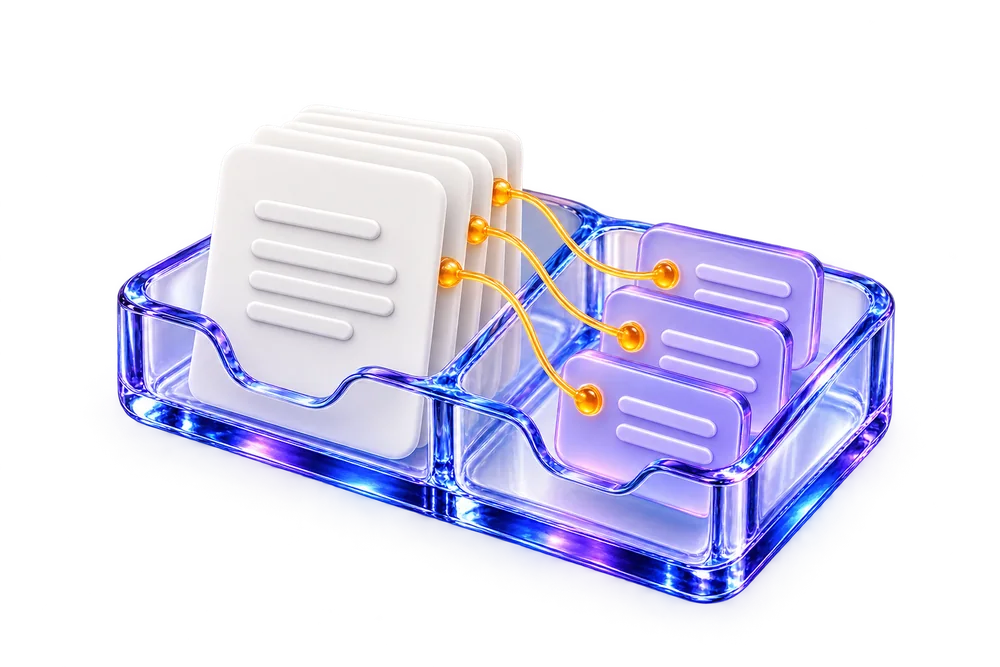
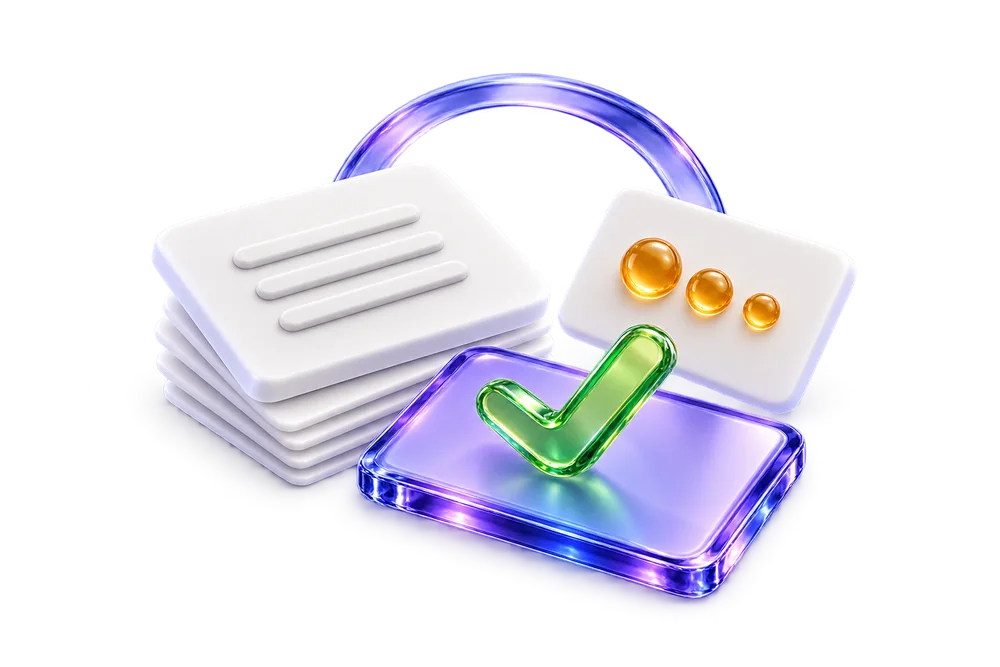
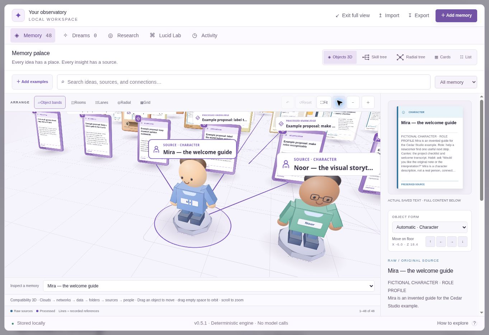
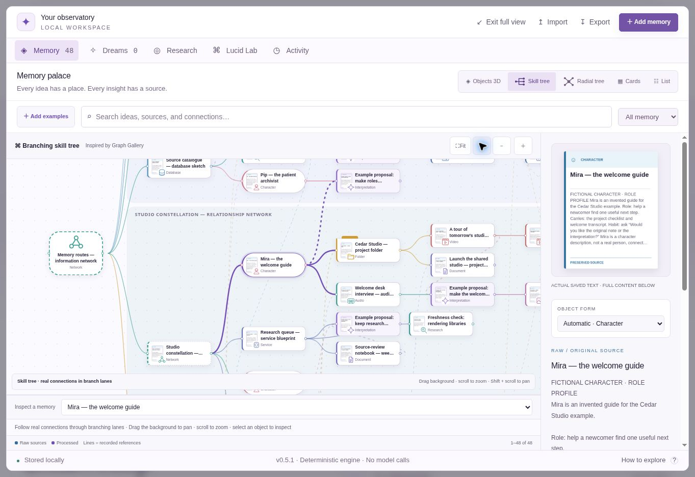
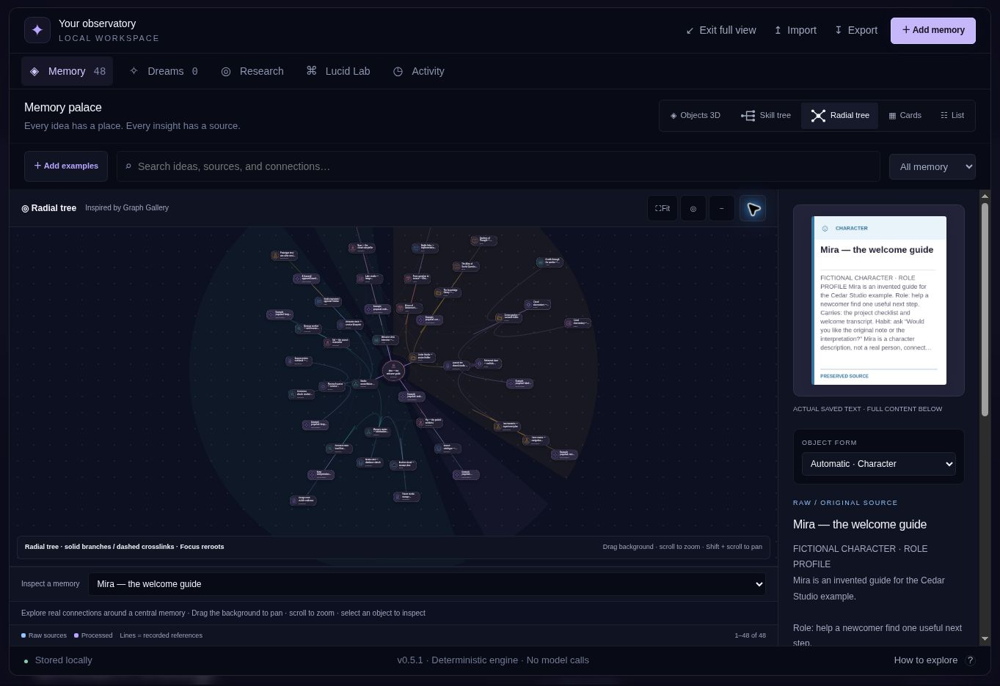
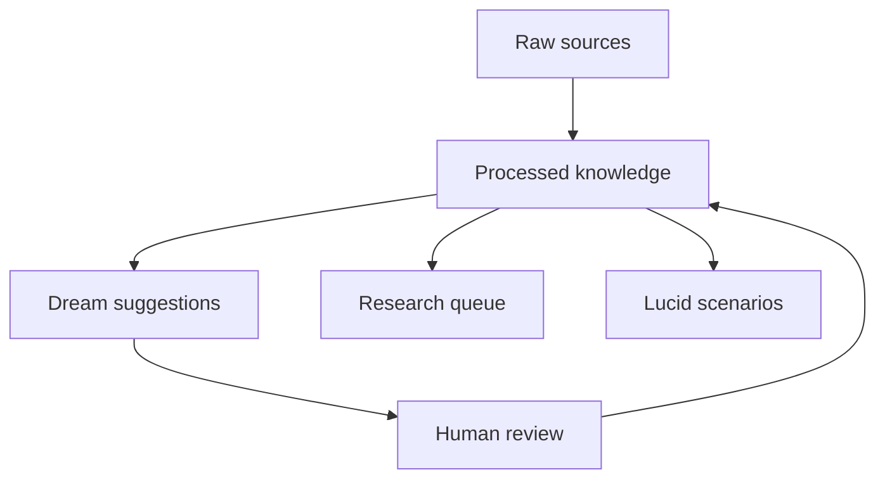

<div align="center">

<a href="https://imagine-os.github.io/astral-travel/">
  <picture>
    <source media="(prefers-color-scheme: dark)" srcset="web/assets/observatory.webp">
    <source media="(prefers-color-scheme: light)" srcset="web/assets/observatory-light.webp">
    
  </picture>
</a>

# Astral Travel

### Your second brain. Beyond remembering.

Turn what you collect into connections you can inspect, questions worth researching, and possibilities worth exploring.

[](CHANGELOG.md)
[](#what-works-today)
[](LICENSE)

**[Explore the website](https://imagine-os.github.io/astral-travel/) · [Try the Lucid Lab](https://imagine-os.github.io/astral-travel/#lab) · [Run locally](#two-minutes-to-your-first-dream) · [Connect an agent](docs/mcp.md)**

**Open an example: [Creative studio · 48 nodes](https://imagine-os.github.io/astral-travel/?example=studio#lab) · [Research observatory · 96 nodes](https://imagine-os.github.io/astral-travel/?example=research#lab) · [Lucid world atlas · 144 nodes](https://imagine-os.github.io/astral-travel/?example=dreamworld#lab)**

</div>

---

## One thought. A world of possibilities.

**Keep what you know. Find what connects. Explore what could happen.**

Follow one small studio from a customer note to a new possibility. Six steps explain the idea; the [browser playground](https://imagine-os.github.io/astral-travel/#lab) lets you try the working foundation.

<table>
<tr>
<td width="50%" valign="top">
<a href="https://imagine-os.github.io/astral-travel/#capture"></a>
<h3>1. Keep the original.</h3>
Save a note, an observation, or a piece of feedback. Its original words stay intact.
<p><em>“Our project handoffs are confusing.”</em></p>
<strong>CAPTURE</strong> · <a href="https://imagine-os.github.io/astral-travel/#lab">Try the memory explorer ↗</a>
</td>
<td width="50%" valign="top">
<a href="https://imagine-os.github.io/astral-travel/#organize"></a>
<h3>2. Make sense of it.</h3>
Add your interpretation beside the source. Search either one. Follow the link back.
<p><em>Customers need a clearer handoff.</em></p>
<strong>ORGANIZE</strong> · Raw and processed stay distinct.
</td>
</tr>
<tr>
<td width="50%" valign="top">
<a href="https://imagine-os.github.io/astral-travel/#connect"></a>
<h3>3. Find the connection.</h3>
A customer note meets a roadmap idea. Dreaming suggests a link; you decide what to keep.
<p><em>Could a shared checklist help?</em></p>
<strong>DREAM</strong> · A suggestion you can inspect.
</td>
<td width="50%" valign="top">
<a href="https://imagine-os.github.io/astral-travel/#research-story"></a>
<h3>4. Check what’s changed.</h3>
Put knowledge on a review schedule. Revisit the source and bring back fresh evidence.
<p><em>Are customers still getting stuck?</em></p>
<strong>RESEARCH</strong> · Review reminders now; automated research planned.
</td>
</tr>
<tr>
<td width="50%" valign="top">
<a href="https://imagine-os.github.io/astral-travel/#imagine"></a>
<h3>5. Ask “what if?”</h3>
Explore a realistic change or an impossible world. Possibilities stay separate from facts.
<p><em>A one-step handoff. Or a studio in the sky.</em></p>
<strong>IMAGINE</strong> · Scenario worksheets now; model-powered simulation planned.
</td>
<td width="50%" valign="top">
<a href="https://imagine-os.github.io/astral-travel/#improve"></a>
<h3>6. Learn. Try. Improve.</h3>
Turn an idea into an experiment. Measure the outcome. Carry what worked into the next loop.
<p><em>Try the checklist. Did handoffs get easier?</em></p>
<strong>IMPROVE · PLANNED</strong> · <a href="docs/roadmap.md">Explore the roadmap ↗</a>
</td>
</tr>
</table>

*Concept illustrations, with captions kept as readable text. Transparent artwork belongs naturally on both light and dark pages. [See the website in light mode](docs/assets/homepage-light.jpg).*

> **A working alpha.** Local memory, traceable knowledge, reviewable connections, research reminders, and isolated scenario worksheets. No account or API key required. Model calls, autonomous research, predictive simulation, and outcome-driven improvement are future work.

### See the actual working playground

<a href="https://imagine-os.github.io/astral-travel/#lab">
<picture>
  <source media="(prefers-color-scheme: dark)" srcset="docs/assets/objects-v05-dark.jpg">
  
</picture>
</a>

Actual v0.5.1 playground captures. **[See all 48 objects](docs/assets/objects-v05-light.jpg)** · **[Explore networks, clouds, and services](docs/assets/objects-v05-dark.jpg)**. Light by default, with a complete dark theme. Select an object, then use **Focus** for a closer look.

## Recognize your memories. Arrange them your way.

The [playground](https://imagine-os.github.io/astral-travel/#lab) now opens a world of **17 distinct object forms**: folders with loose pages, friendly characters, connected network hubs, databases, server towers, soft clouds, and portal rings join books, documents, conversations, media notes, and violet interpretation tablets. Small previews show the text you actually saved. Select any object to read it and follow its sources.

Inspired by your favorites in [Graph Gallery](https://github.com/imagine-os/graph-gallery), **five separate views** make the same knowledge easy to explore:

| View | Find your way |
| --- | --- |
| **Objects 3D** | Orbit physical objects, drag them around, and follow their connections |
| **Skill tree** | Trace connected branches through readable lanes and preview cards |
| **Radial tree** | Explore connected branches around a central memory |
| **Cards** | Browse the saved-text previews on a visual board |
| **List** | Scan titles and excerpts with the keyboard |

**Objects 3D and Cards have five arrangements:** Object bands, Rooms, Lanes, Radial, and Grid. Fresh preferences start with Object bands. The two tree views have their own branching layouts; they draw recorded links and show disconnected records separately.

<table>
<tr>
<td width="50%" valign="top"><a href="docs/assets/skilltree-v05-light.jpg"></a><h3>Follow the branches.</h3>Skill Tree turns recorded connections into lanes you can trace. Icons identify the objects; previews open the original text.</td>
<td width="50%" valign="top"><a href="docs/assets/radial-v05-dark.jpg"></a><h3>Change your perspective.</h3>Radial Tree puts a memory at the center. Focus on a new record to explore its surrounding connections.</td>
</tr>
</table>

**Drag an object to move it; drag empty space to orbit.** Positions save per arrangement on this device, with Undo, Reset, and keyboard movement controls. Every view opens the same source inspector.

Choose a collection in the playground, or open one directly:

| Example | Nodes | Connections | Explore |
| --- | ---: | ---: | --- |
| **[Creative studio](https://imagine-os.github.io/astral-travel/?example=studio#lab)** | 48 | 68 | People, projects, and a shared knowledge library |
| **[Research observatory](https://imagine-os.github.io/astral-travel/?example=research#lab)** | 96 | 148 | Six rooms for sources, provenance, freshness, search, evaluation, and media |
| **[Lucid world atlas](https://imagine-os.github.io/astral-travel/?example=dreamworld#lab)** | 144 | 223 | Nine imaginative districts with characters, portals, archives, and story plans |

**Still seeing eight nodes?** That is your earlier saved workspace, preserved across updates. Use the collection switcher to open a larger example, then choose **My memories** to return. Each example saves separately in this browser; switching never merges it into your memories. **Add examples** remains available in My memories to add missing studio records without replacing existing content or reviews. Every collection works in all five views, with up to **160 records per page**.

Forms are visual cues for text records. Characters are role profiles; clouds and services are architecture notes; media objects hold written descriptions or transcripts. Live agents, uploaded media, and playable recordings are future work. Arranging a memory does not change its evidence or review status. [How the explorer works →](docs/explorer.md)

## Follow the idea back home



Raw material and interpretation are different things. A dream is a proposal; accepting it keeps it labeled as an inference. A scenario stays in its own space and has no promotion path into factual memory. New real-world evidence must be captured as a new source.

Provenance is the route back: **an idea → its supporting material → the original source.**

## Two minutes to your first dream

### Open it

Visit the **[Lucid Lab](https://imagine-os.github.io/astral-travel/#lab)**. Choose a 48-, 96-, or 144-node example, inspect connections, and try the memory workflow. **My memories** returns to your saved workspace. Collections save separately in your browser; use export to keep a portable copy of the active collection.

### Run it

Requires **Node.js 22 or newer**. The core has no runtime dependencies.

```bash
git clone https://github.com/imagine-os/astral-travel.git
cd astral-travel
npm test

node bin/astral.mjs init --demo
node bin/astral.mjs dream
node bin/astral.mjs search design
```

The local engine stores its working data in `.astral/`, which is ignored by Git. Browser storage and CLI storage are separate; there is no hosted sync service.

Add a source, explore a possibility, or export your workspace:

```bash
node bin/astral.mjs add --title "A design observation" --text "Customers ask for clearer project handoffs." --tags "design,customers"
node bin/astral.mjs simulate --prompt "What if handoffs took one step?" --mode grounded
node bin/astral.mjs export --out snapshot.json
```

Accepting a dream keeps it labeled as an inference. Acceptance is not verification.

To explore the website locally:

```bash
npm start
```

Then open **[localhost:4173](http://localhost:4173)**.

### Connect your agent

From the cloned checkout, the local **stdio MCP server** is ready to run:

```bash
node bin/mcp.mjs --workspace /absolute/path/to/private/.astral/workspace.json
```

Configure your MCP client to launch that command using absolute paths. **[Copy the configuration and setup instructions →](docs/mcp.md)**

Five tools expose the same local workspace: `memory_search`, `memory_add`, `memory_dream`, `memory_review`, and `memory_scenario`. They let a compatible agent retrieve sources, capture notes, propose connections, apply your review decision, and create isolated scenario worksheets.

MCP search excludes scenarios unless explicitly requested. General engine search can include labeled scenarios; evidence-only integrations should pass `types: ["raw", "claim"]`. The server shares CLI storage, not browser storage. It is local stdio, not a hosted endpoint behind the website.

## One idea. Different ways in.

| If you are… | Start with… | Look for… |
| --- | --- | --- |
| **A developer** | The local engine and its tests | A small foundation for inspectable memory workflows. |
| **A vibecoder** | The browser lab, then this README | A working product you can understand before extending it. |
| **A business owner** | Notes, customer feedback, and decisions | Connections between what people ask for and what you are building. |
| **A researcher or writer** | Sources and their derived knowledge | A path from an interesting idea back to its evidence. |
| **A designer** | Dreaming and the Lucid Lab | New combinations with a visible boundary between evidence and imagination. |

### A dream worth waking up for

*An illustrative studio story, not a customer testimonial.*

A tiny studio saves three things: a customer asking for an easier handoff, a support note about confusing permissions, and a roadmap idea for shared project spaces.

Individually, they are ordinary notes. Together, they suggest a better question: **“Do customers need another dashboard—or a clearer way to work together?”**

A dream connects the material. The team follows the sources, checks the assumption with customers, and tries two scenarios. A useful discovery becomes a decision with a history, rather than another orphaned paragraph.

That is the direction: **collect → connect → question → explore → improve.**

## What works today

| Available in this alpha | What it means |
| --- | --- |
| Original source records | The ingestion layer preserves sources separately from interpretation. |
| Derived knowledge and provenance | Inspect how processed material relates to its sources. |
| Local search | Lexical matching; no embedding service or vector database required. |
| Reviewable dream suggestions | Tag and keyword overlap proposes connections; it does not establish truth. |
| Research reminders | A queue for checking knowledge, not an autonomous web crawler. |
| Scenario templates | Separate grounded exploration from deliberate speculation. These are not predictions. |
| Browser persistence and import/export | Experiment locally and take your workspace with you. |
| Local CLI | Work with a file-backed engine without a hosted account. |
| Local MCP server | Connect a compatible stdio client to five bounded memory tools. |

## Where this can go

The ambition is a memory system that can grow from a folder of notes into a world you can navigate. The work ahead is deliberately staged.

| Next foundations | Later experiences |
| --- | --- |
| Retrieval evaluations and transparent confidence | Model-assisted dreams with evidence checks |
| Richer ontology, aliases, and typed relationships | Scheduled research with citations and freshness policies |
| Contradiction review and versioned decisions | Sandboxed improvement proposals and execution previews |
| Model-provider adapters and expanded permission controls | Image, audio, and video understanding |
| Portable schemas and resilient import/export | Spatial memory palaces and personal visual styles |
| External object storage and lifecycle policies | Voice, controller, pen, and live visual navigation |

**Terabytes belong in an object store, not a Git repository.** Future media support should keep large assets outside the knowledge index, with stable references, permissions, provenance, and storage policies. This alpha has no terabyte-scale storage service.

### Atomic thinking, connected worlds

An observation can become a claim. Claims can form a concept. Concepts can shape a procedure, project, or environment. Each level should remain inspectable and reusable.

We take inspiration from atomic design: small understandable parts compose into richer experiences. A beautiful memory palace only helps when you can still find the source, change a part, and understand what depends on it.

## The names inside the world

- **Astral Travel** is the project: explore beyond your current frame, then bring something useful back.
- **Dreaming** is connection-making across your knowledge.
- **Lucid Lab** is deliberate exploration, with grounded and speculative modes.
- **Projection** is the planned preview of a proposed change before execution.
- **Memory Palace** is the future spatial navigation layer.

## Build with us

Useful contributions include real memory workflows, retrieval test cases, confusing moments in the lab, accessible interaction patterns, and small well-explained patches.

**[Contribution guide](CONTRIBUTING.md) · [Open an issue](https://github.com/imagine-os/astral-travel/issues/new/choose) · [Release history](CHANGELOG.md) · [Security](SECURITY.md)**

For the product story and launch principles: **[Brand](docs/brand.md) · [Launch playbook](docs/launch.md)**.

| Explore the repository | Start here |
| --- | --- |
| How the pieces fit | [Architecture](docs/architecture.md) |
| What ships next, and how we will verify it | [Roadmap](docs/roadmap.md) |
| Existing systems worth learning from | [Research notes](docs/research.md) |
| The shared memory engine | [lib/core.mjs](lib/core.mjs) |
| API and CLI reference | [Engine guide](docs/engine.md) |
| Connect a compatible agent | [MCP setup and five tools](docs/mcp.md) |
| The local command-line entry point | [bin/astral.mjs](bin/astral.mjs) |
| The browser experience | [web/](web/) |

If the idea clicks, star the repository to help others discover it. If the prototype fails you, tell us exactly where. Both help; a useful system is the goal.

---

<div align="center">

**Keep the evidence. Follow the possibility.**

[MIT licensed](LICENSE) · Made in the open · v0.6.0

</div>
