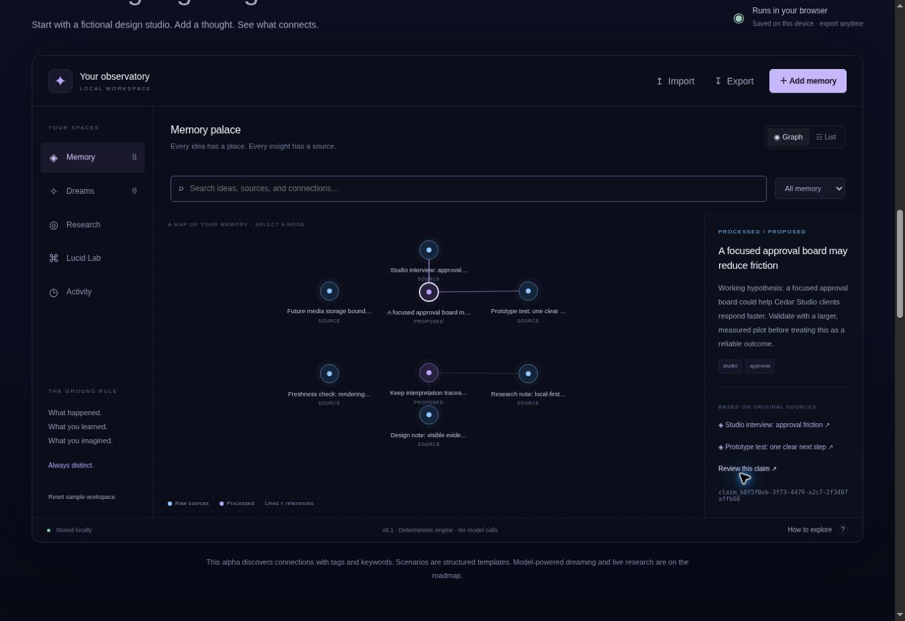
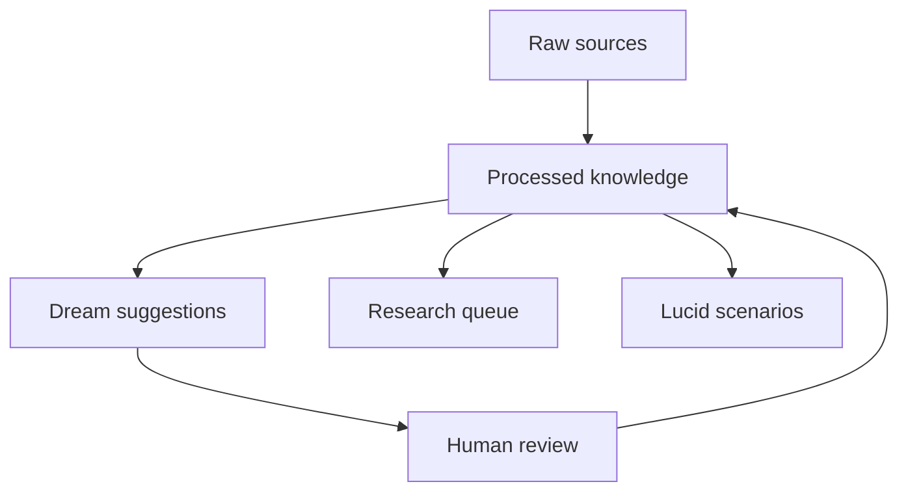

<div align="center">

[](https://imagine-os.github.io/astral-travel/)

# Astral Travel

### Your second brain. Beyond remembering.

Turn what you collect into connections you can inspect, questions worth researching, and possibilities worth exploring.

[](CHANGELOG.md)
[](#what-works-today)
[](LICENSE)

**[Explore the website](https://imagine-os.github.io/astral-travel/) · [Try the Lucid Lab](https://imagine-os.github.io/astral-travel/#lab) · [Run locally](#two-minutes-to-your-first-dream) · [Connect an agent](docs/mcp.md)**

</div>

---

## A memory should lead somewhere.

Your notes remember what happened. Your bookmarks remember what looked interesting. Your research folder remembers what you meant to read.

**Astral Travel asks what those things could become together.**

Keep original material intact. Give ideas an address. Find a surprising connection. Check what needs updating. Explore a possible future. Bring a useful decision back to the present.

The first release is a small, working foundation: a browser lab, a local JavaScript engine, and a local MCP connection for compatible agents. The suggestions are deterministic and reviewable; no model key is required.

## Five ways to move beyond a pile of notes

| Mode | The question | What v0.1 does |
| --- | --- | --- |
| **Memory** | “What do I know, and where did it come from?” | Separate original sources from derived knowledge, retain provenance, and search locally. |
| **Dreaming** | “What belongs together that I haven’t connected?” | Suggest connections from shared tags and keywords. You decide what to keep. |
| **Research** | “What might need another look?” | Build a review queue for knowledge that needs checking. You supply the research. |
| **Lucid Lab** | “What if things were different?” | Organize grounded and speculative scenarios in separate templates. |
| **Improvement** | “What is worth changing?” | Review suggestions and proposed next steps before incorporating them. |

> **Alpha, with a clear boundary.** This release does not run language models, browse the web, predict outcomes, or make changes to your other tools. Autonomous research, model providers, remote hosting, and execution integrations are roadmap work.

[](https://imagine-os.github.io/astral-travel/#lab)

*Actual v0.1 playground: original sources, processed interpretations, and traceable references.*

## Follow the idea back home



Raw material and interpretation are different things. A dream is a proposal; accepting it keeps it labeled as an inference. A scenario stays in its own space and has no promotion path into factual memory. New real-world evidence must be captured as a new source.

Provenance is the route back: **an idea → its supporting material → the original source.**

## Two minutes to your first dream

### Open it

Visit the **[Lucid Lab](https://imagine-os.github.io/astral-travel/#lab)**. Explore the sample material, inspect connections, and try the memory workflow. Demo data is stored in your browser; use export to keep a portable copy.

### Run it

Requires **Node.js 22 or newer**. The core has no runtime dependencies.

```bash
git clone https://github.com/imagine-os/astral-travel.git
cd astral-travel
npm test

node bin/astral.mjs init --demo
node bin/astral.mjs dream
node bin/astral.mjs search design
```

The local engine stores its working data in `.astral/`, which is ignored by Git. Browser storage and CLI storage are separate; there is no hosted sync service.

Add a source, explore a possibility, or export your workspace:

```bash
node bin/astral.mjs add --title "A design observation" --text "Customers ask for clearer project handoffs." --tags "design,customers"
node bin/astral.mjs simulate --prompt "What if handoffs took one step?" --mode grounded
node bin/astral.mjs export --out snapshot.json
```

Accepting a dream keeps it labeled as an inference. Acceptance is not verification.

To explore the website locally:

```bash
npm start
```

Then open **[localhost:4173](http://localhost:4173)**.

### Connect your agent

From the cloned checkout, the local **stdio MCP server** is ready to run:

```bash
node bin/mcp.mjs --workspace /absolute/path/to/private/.astral/workspace.json
```

Configure your MCP client to launch that command using absolute paths. **[Copy the configuration and setup instructions →](docs/mcp.md)**

Five tools expose the same local workspace: `memory_search`, `memory_add`, `memory_dream`, `memory_review`, and `memory_scenario`. They let a compatible agent retrieve sources, capture notes, propose connections, apply your review decision, and create isolated scenario worksheets.

MCP search excludes scenarios unless explicitly requested. General engine search can include labeled scenarios; evidence-only integrations should pass `types: ["raw", "claim"]`. The server shares CLI storage, not browser storage. It is local stdio, not a hosted endpoint behind the website.

## One idea. Different ways in.

| If you are… | Start with… | Look for… |
| --- | --- | --- |
| **A developer** | The local engine and its tests | A small foundation for inspectable memory workflows. |
| **A vibecoder** | The browser lab, then this README | A working product you can understand before extending it. |
| **A business owner** | Notes, customer feedback, and decisions | Connections between what people ask for and what you are building. |
| **A researcher or writer** | Sources and their derived knowledge | A path from an interesting idea back to its evidence. |
| **A designer** | Dreaming and the Lucid Lab | New combinations with a visible boundary between evidence and imagination. |

### A dream worth waking up for

*An illustrative studio story, not a customer testimonial.*

A tiny studio saves three things: a customer asking for an easier handoff, a support note about confusing permissions, and a roadmap idea for shared project spaces.

Individually, they are ordinary notes. Together, they suggest a better question: **“Do customers need another dashboard—or a clearer way to work together?”**

A dream connects the material. The team follows the sources, checks the assumption with customers, and tries two scenarios. A useful discovery becomes a decision with a history, rather than another orphaned paragraph.

That is the direction: **collect → connect → question → explore → improve.**

## What works today

| Available in this alpha | What it means |
| --- | --- |
| Original source records | The ingestion layer preserves sources separately from interpretation. |
| Derived knowledge and provenance | Inspect how processed material relates to its sources. |
| Local search | Lexical matching; no embedding service or vector database required. |
| Reviewable dream suggestions | Tag and keyword overlap proposes connections; it does not establish truth. |
| Research reminders | A queue for checking knowledge, not an autonomous web crawler. |
| Scenario templates | Separate grounded exploration from deliberate speculation. These are not predictions. |
| Browser persistence and import/export | Experiment locally and take your workspace with you. |
| Local CLI | Work with a file-backed engine without a hosted account. |
| Local MCP server | Connect a compatible stdio client to five bounded memory tools. |

## Where this can go

The ambition is a memory system that can grow from a folder of notes into a world you can navigate. The work ahead is deliberately staged.

| Next foundations | Later experiences |
| --- | --- |
| Retrieval evaluations and transparent confidence | Model-assisted dreams with evidence checks |
| Richer ontology, aliases, and typed relationships | Scheduled research with citations and freshness policies |
| Contradiction review and versioned decisions | Sandboxed improvement proposals and execution previews |
| Model-provider adapters and expanded permission controls | Image, audio, and video understanding |
| Portable schemas and resilient import/export | Spatial memory palaces and personal visual styles |
| External object storage and lifecycle policies | Voice, controller, pen, and live visual navigation |

**Terabytes belong in an object store, not a Git repository.** Future media support should keep large assets outside the knowledge index, with stable references, permissions, provenance, and storage policies. This alpha has no terabyte-scale storage service.

### Atomic thinking, connected worlds

An observation can become a claim. Claims can form a concept. Concepts can shape a procedure, project, or environment. Each level should remain inspectable and reusable.

We take inspiration from atomic design: small understandable parts compose into richer experiences. A beautiful memory palace only helps when you can still find the source, change a part, and understand what depends on it.

## The names inside the world

- **Astral Travel** is the project: explore beyond your current frame, then bring something useful back.
- **Dreaming** is connection-making across your knowledge.
- **Lucid Lab** is deliberate exploration, with grounded and speculative modes.
- **Projection** is the planned preview of a proposed change before execution.
- **Memory Palace** is the future spatial navigation layer.

## Build with us

Useful contributions include real memory workflows, retrieval test cases, confusing moments in the lab, accessible interaction patterns, and small well-explained patches.

**[Contribution guide](CONTRIBUTING.md) · [Open an issue](https://github.com/imagine-os/astral-travel/issues/new/choose) · [Release history](CHANGELOG.md) · [Security](SECURITY.md)**

For the product story and launch principles: **[Brand](docs/brand.md) · [Launch playbook](docs/launch.md)**.

| Explore the repository | Start here |
| --- | --- |
| How the pieces fit | [Architecture](docs/architecture.md) |
| What ships next, and how we will verify it | [Roadmap](docs/roadmap.md) |
| Existing systems worth learning from | [Research notes](docs/research.md) |
| The shared memory engine | [lib/core.mjs](lib/core.mjs) |
| API and CLI reference | [Engine guide](docs/engine.md) |
| Connect a compatible agent | [MCP setup and five tools](docs/mcp.md) |
| The local command-line entry point | [bin/astral.mjs](bin/astral.mjs) |
| The browser experience | [web/](web/) |

If the idea clicks, star the repository to help others discover it. If the prototype fails you, tell us exactly where. Both help; a useful system is the goal.

---

<div align="center">

**Keep the evidence. Follow the possibility.**

[MIT licensed](LICENSE) · Made in the open · v0.1.0

</div>
